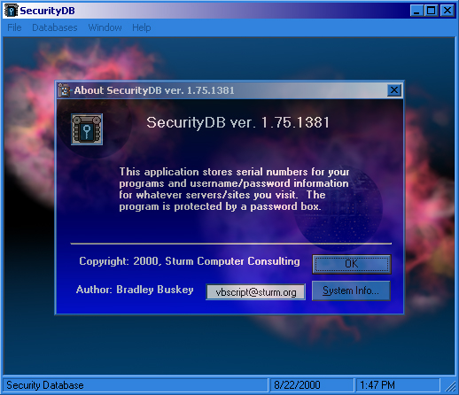



## A Security DB

### Description

I have made this program much better. It will determine which version of windows you are running and allow different features to be used. In Win9x, it will grab the casched passwords, in 2000 it has transparent forms (some are), and in Nt 4, both Casched Passwords and transparency are turned off. It allows you to change your password to open the DB (starts as PASSWORD all lowercase) and allows you to put the database file i a new location and load it, or open a different database. I have included a search feature for both the Passwords and Serial numbers. I have written a help file project, and will distribute the finished help file in another zip with the runtime. Please leave me some comments.
 
### More Info
 

             |
---                |---
**Submitted On**   |2000-08-22 13:10:12
**By**             |[VBScript](https://github.com/Planet-Source-Code/PSCIndex/blob/master/ByAuthor/vbscript.md)
**Level**          |Intermediate
**User Rating**    |4.5 (27 globes from 6 users)
**Compatibility**  |VB 6\.0
**Category**       |[Complete Applications](https://github.com/Planet-Source-Code/PSCIndex/blob/master/ByCategory/complete-applications__1-27.md)
**World**          |[Visual Basic](https://github.com/Planet-Source-Code/PSCIndex/blob/master/ByWorld/visual-basic.md)
**Archive File**   |[CODE\_UPLOAD92128222000\.zip](https://github.com/Planet-Source-Code/vbscript-a-security-db__1-10910/archive/master.zip)

